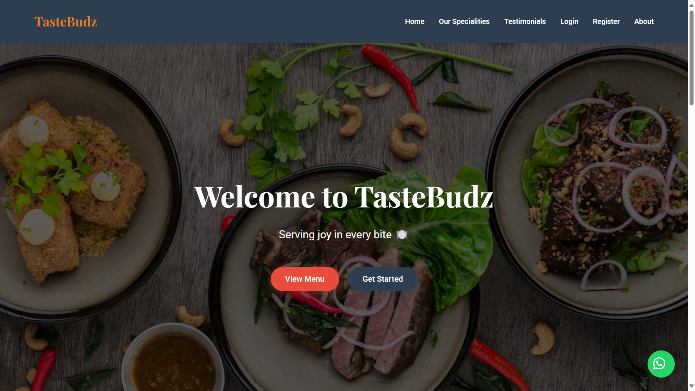

# 🍽️ TasteBudz - Frontend Dashboard UI

Welcome to **TasteBudz**, a stylish and responsive restaurant dashboard web app made using HTML, CSS, and a sprinkle of JavaScript magic ✨. This is a static frontend project designed to mimic a premium user dashboard experience.

## 🔥 Features

- 🧭 Sidebar navigation with icons and active state
- 🔍 Search bar and notification/cart badges
- 🙋‍♀️ Personalized welcome banner (Hey Jesli!)
- ⚡ Quick Actions section with icons and hover effects
- 🧾 Recent Orders with reorder option
- 🧠 Smart Recommendations with food tags (Popular, New, Healthy)
- 🎨 Smooth scroll animations using AOS library
- 🍰 Responsive layout (mobile-ready)

## 🛠️ Tech Stack

- **HTML5**
- **CSS3**
- **JavaScript**
- **AOS** for animation on scroll
- **Font Awesome** for icons
- **Google Fonts** for typography

## 🚀 How to Run

1. Clone this repo or just download the files.
2. Open `dashboard.html` in your browser.
3. Boom 💥 You're in the dashboard world of TasteBudz.

## 🌐 CDN Libraries Used

- [Font Awesome](https://cdnjs.com/libraries/font-awesome)
- [Google Fonts](https://fonts.google.com/)
- [AOS Animation](https://michalsnik.github.io/aos/)

## 📸 Screenshot

> 

## ✨ Future Scope

- 🔐 Add login/signup pages
- 🛒 Cart functionality with JS
- 🍕 Connect to backend (Flask, Django, etc.)
- 💬 Add real-time chatbot

## 🙌 Acknowledgements

Designed with love by [Jesli 💛] – powered by food cravings and frontend fun!

---

**Made with 🍔, 🎨 & 💻 by Jesli + Jarvis**
