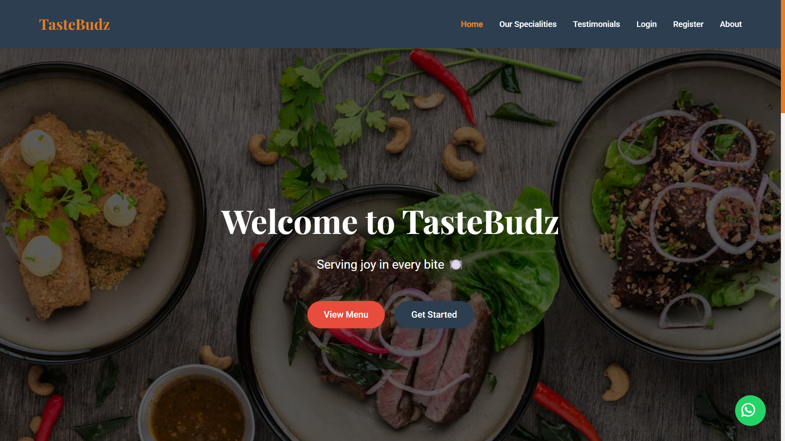

# TasteBudz 
*A responsive and animated frontend-only food website designed by Jesli*

---

## About the Project

**TasteBudz** is a purely frontend-based restaurant website created as part of my learning journey in frontend development. The goal of this project is to improve my skills in building responsive layouts, applying creative animations, and enhancing user interaction through smooth transitions — all using HTML, CSS, and JavaScript.

This project does **not** include any backend logic or database integration. It’s focused solely on user interface and experience design.

---

## Key Features

- Fully **responsive design** for mobile, tablet, and desktop
- Clean and modern **UI/UX** approach
- Smooth **page transitions** and **custom animations**
- Reusable UI components across pages
- Organized and scalable **folder structure**
- Interactive elements like hover effects, modals, forms, etc.

---

## Project Structure
```
    TasteBudz/ 
        ├── index.html → Home page
        ├── templates/ 
            ├── login.html → Login page 
            ├── register.html → Registration page 
            ├── about.html → About TasteBudz  
            ├── dashboard.html → User dashboard (frontend mock) 
            ├── profile.html → Profile page 
            ├── settings.html → Settings page  
            ├── favorites.html → Favorite dishes page
        ├── statics/ 
            │ all css files 
        ├── images/ 
            │ screenshot of the website
        ├── README.md → README file
```

---

## What’s Not Included

- No backend logic or database
- No API integrations
- No real authentication or dynamic data
- Not deployed

---

## Purpose

This project was developed strictly for **practice and learning purposes**. My main objectives were to:

- Learn how to structure a scalable multi-page frontend project
- Enhance my understanding of layout design using Flexbox & Grid
- Experiment with creative animations and interactive transitions
- Build a visually pleasing project that works well across all devices

---

## Technologies Used

- **HTML5**
- **CSS3**
- **JavaScript (ES6)**
- **Responsive Design (Flexbox & Grid)**
- **Custom Animations & Transitions**

---

## CDN Libraries Used

- [Font Awesome](https://cdnjs.com/libraries/font-awesome)
- [Google Fonts](https://fonts.google.com/)
- [AOS (Animate on Scroll)](https://michalsnik.github.io/aos/)

---

## How to Run the Project

1. **Clone the repository:**
```bash
git clone https://github.com/jeslipriya/Restaurant-Frontend.git
```

2. **Navigate to the project directory:**
```bash
cd Restaurant-Frontend
```

5. **Open the application in your browser:**
```
http://localhost:5000
```

---

## Author

Designed and developed by **Jesli**  
*Frontend developer in the making — learning, building, and improving every day.*

---

## Preview



---

> ⚠️ *Note: This project is not deployed and does not contain any functional backend logic. It is for design and UI/UX demonstration purposes only.*
